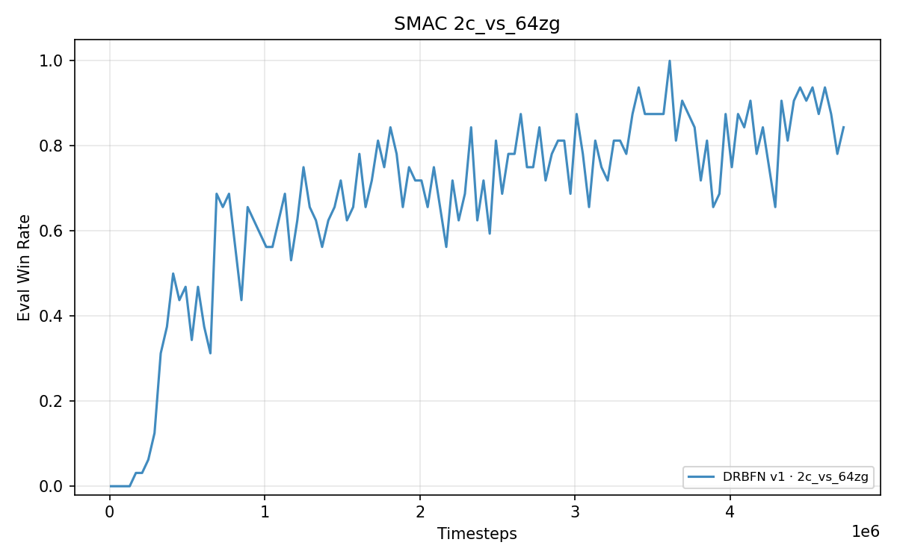

# DRBFN：奖励生成——用条件贝叶斯流网络从团队回报学习个体奖励

> **Reward Generation: Learning Individual Rewards from Team Returns via Conditional Bayesian Flow Networks**
>
> 合作多智能体强化学习信用分配的生成式范式：个体奖励不由人工设计、不由值分解隐式承担、不由反事实参照估计，而是由**条件贝叶斯流网络（BFN）**生成——仅以团队回报为训练信号。

**基于**：[marlbenchmark/on-policy](https://github.com/marlbenchmark/on-policy)（MAPPO 官方实现）
**测试环境**：StarCraft Multi-Agent Challenge（SMAC），8 张地图，2–10 个智能体，覆盖同质与异质队伍（含治疗型 Medivac）
**论文工作稿**：[CCC.md](CCC.md)（唯一工作版本）

---

## TL;DR

合作 MARL 中环境只返回单一团队奖励 $R$，标准做法给每个智能体分 $R/N$——所有人拿到同一个数，信用分配无从发生。本工作提出**奖励生成**：把"从团队反馈到个体奖励"这个欠定映射表示为条件分布 $p_\phi(\boldsymbol{\psi}\mid s,\mathbf{a})$（$\boldsymbol{\psi}$ 为逐智能体势），从中采样、经势差形式组合为个体奖励：

$$r_i(t) = \frac{R_t}{N} + \beta_t\,\kappa\,\big(\gamma\,\psi_i(s_{t+1},\mathbf{a}_{t+1}) - \psi_i(s_t,\mathbf{a}_t)\big)$$

系统由**三个学习器**组成，信号源彼此独立：

| 学习器 | 输入信号 | 更新规则 |
|---|---|---|
| 团队评论家 $Q_{tot}$ | 真实奖励 $R$ | $n$-step TD 回归 |
| 奖励生成器 $p_\phi$（BFN） | 团队优势 $A^{tot}$ | REINFORCE：$\nabla_\phi J = \mathbb{E}[\nabla_\phi\log p_\phi(\boldsymbol{\psi}\mid s,\mathbf{a})\cdot A^{tot}]$ |
| 策略 $\pi_i$ | 生成奖励 $r_i$ | PPO（零修改） |

**为什么这是对的**（详见 [CCC.md](CCC.md) §4.6）：

- **定理 1（优势分化）**：共享奖励 + 共享评论家下，所有智能体的 GAE 优势恒相等——逐智能体信用**不可表示**；生成奖励下优势自然分化。
- **定理 2（无偏性）**：团队优势经 REINFORCE 训练生成器是无偏的策略梯度——不需要监督标签、层级优化或反事实评估。
- **有界性**：势差项沿任意轨迹的折扣累积与回合长度无关，策略的长期目标始终锚定在真实回报上（PBRS 伸缩性质）。

---

## 实验结果（SMAC，8 地图）

格式：峰值胜率 / 末段 10 次评估均值（%）。统一步数预算对齐（3m 1M；2s_vs_1sc、2s3z 2.5M；其余 5M）。单种子，32 局评估。

| 地图 | N / 类型 | DRBFN（本工作） | MAPPO 复现 | MAPPO 文献值 |
|---|---|---|---|---|
| 3m | 3 / 同质 | 100 / 93.1 † | 100 / 99.4 | 100 / 100 |
| 2s_vs_1sc | 2 / 同质 | 100 / 99.1 † | 100 / 98.8 | 100 / 100 |
| 2c_vs_64zg | 2 / 同质 | **93.8 / 85.6** † | 84.4 / 75.9 | 100 / 98.4 |
| 5m_vs_6m | 5 / 同质 | 87.5 / 76.9 | **93.8 / 83.4** | 88.3 / 87.5 |
| 2s3z | 5 / 异质×2 | **100 / 99.1** | — | 100 / 100 |
| 3s5z | 8 / 异质×2 | **93.8 / 80.3** | — | 96.9 / 96.9 |
| 1c3s5z | 9 / 异质×3 | **100 / 96.2** | — | 96.9 / 100 |
| MMM2 | 10 / 异质×3 | 78.1 / 64.7 ‡ | 78.1 / 65.6 | 87.5 / 86.7 |

† 该图为反事实信号驱动的生成器变体（消融见下）。‡ MMM2 训练在 5.68M 因 SC2 崩溃终止、终止时仍在上升，崩溃前峰值 84.4。

|  |  |
|---|---|
| 2c_vs_64zg：DRBFN 2.72M 破 90%，MAPPO 复现 5M 内未过 84.4 | MMM2（Super Hard）：与 MAPPO 复现同节奏上升 |

**消融——生成器的驱动信号**（3s5z，同一生成器、同一训练管线，仅换驱动信号）：

| 驱动信号 | 3s5z 峰值 | 机制 |
|---|---|---|
| 反事实 $Q_{tot}(s,\mathbf{a}) - Q_{tot}(s,(c_i,\mathbf{a}_{-i}))$ | 9.4% | 参照动作 $c_i$ 语义在异质单位上失效 |
| **团队优势（本方法）** | **93.8%** | 无需个体参照，类型无关 |

**生成器行为**（MMM2 收敛检查点，32 评估回合探针）：每步跨智能体标准差均值 0.040（共享奖励下恒为 0，即定理 1 的实证）；三类单位势均值分层（Marauder −0.066 / Marine −0.015 / Medivac −0.008）——生成器从不含类型信息的条件输入中**隐式恢复**了类型相关归因。探针数据 `probe_psi_MMM2.npz`、分析脚本 `analysis/probe_generator.py`。

---

## 方法与版本演化

| 版本 | 目录 | 核心设计 | 状态 |
|---|---|---|---|
| DRBFN v1/v2/v3 | `onpolicy/algorithms/r_drbfn`, `r_drbfn_v2`, `r_drbfn_v3` | 加性值分解 + 奖励守恒约束 + $\Delta Q_i$ 条件特征 | 早期探索 |
| DRBFN-QVPO | `onpolicy/algorithms/r_drbfn_qvpo`（初期形态） | BFN + PBRS + Q-加权变分下界 | 归档：[docs/DRBFN_QVPO_notes.md](docs/DRBFN_QVPO_notes.md) |
| **DRBFN（最终版）** | `onpolicy/algorithms/r_drbfn_qvpo`（演化后）+ `exp_scripts/run_*_final.sh` | **奖励生成范式：团队优势 + REINFORCE + PPO 零修改** | 主线，对应 [CCC.md](CCC.md) |

从守恒约束到生成范式的演化动机（守恒的刚性、条件特征漂移、层级优化复杂度）见 CCC.md §"设计演化"。

---

## 仓库结构

```
DRBFN-MARL/
├── CCC.md                                # ★ 论文工作稿（唯一工作版本）
├── README.md                             # 本文件
├── docs/
│   ├── DRBFN_QVPO_notes.md               # 旧版 README 归档（QVPO 变体，2026-07 口径）
│   ├── METHOD.md / RESULTS.md / REPRODUCE.md
├── onpolicy/
│   ├── algorithms/
│   │   ├── r_drbfn_qvpo/                 # ★ 主实现（已演化为最终 REINFORCE 版）
│   │   ├── r_drbfn / r_drbfn_v2 / r_drbfn_v3   # 早期版本
│   │   └── r_mappo/                      # MAPPO baseline
│   ├── config.py                         # DRBFN 专用参数
│   └── scripts/train/train_smac.py       # 训练入口
├── exp_scripts/                          # run_*_final.sh（最终版）/ run_qvpo_*.sh（早期）
├── analysis/                             # 曲线解析、绘图、生成器探针
├── probe_psi_3s5z.npz / probe_psi_MMM2.npz   # 生成器行为探针数据
└── results/                              # 训练日志、曲线、图
```

---

## 安装

**测试通过**：Windows 11 + Python 3.12 + PyTorch 2.x + CUDA 12.x。

```bash
# 1. 克隆
git clone https://github.com/hang-ZYM/DRBFN-MARL.git
cd DRBFN-MARL

# 2. 创建环境
conda env create -f environment.yaml
conda activate marl

# 3. 安装 StarCraft II（SMAC 依赖）
# 从 http://blzdistsc2-a.akamaihd.net/Windows/SC2.4.10.zip 下载 SC2.4.10
# 解压到 ~/StarCraftII/（设置 SC2PATH 环境变量）
# 下载 SMAC 地图：https://github.com/oxwhirl/smac/raw/master/smac_maps/SMAC_Maps.zip
```

完整安装（含 Windows SC2 踩坑）见 [docs/REPRODUCE.md](docs/REPRODUCE.md)。

---

## 快速开始

```bash
# 3m（验证 pipeline，1M 步）
python onpolicy/scripts/train/train_smac.py \
    --env_name StarCraft2 \
    --algorithm_name r_drbfn_qvpo \
    --experiment_name drbfn_3m \
    --map_name 3m \
    --num_env_steps 1000000 \
    --use_eval --eval_episodes 32

# MMM2（Super Hard，超参照 MAPPO 论文专用参数：ppo_epoch 5 / num_mini_batch 2 / gain 1）
bash exp_scripts/run_mmm2_final.sh

# MAPPO baseline 作对比
python onpolicy/scripts/train/train_smac.py \
    --env_name StarCraft2 \
    --algorithm_name rmappo \
    --map_name 5m_vs_6m \
    --num_env_steps 5000000 \
    --use_eval --use_linear_lr_decay
```

其余地图的完整命令见 `exp_scripts/run_*_final.sh`（以脚本为准）。

### DRBFN 关键超参数

```bash
--drbfn_warmup_t 20000    # warmup：先用 R/N 训稳 Q_tot，生成项再介入（β 日程）
--drbfn_phi_clamp 0.3     # 势的范围约束
--drbfn_n_step 5          # 团队评论家的 n-step return horizon
```

PPO 部分沿用 MAPPO 官方超参；逐地图差异（如 MMM2 的 `ppo_epoch 5 / num_mini_batch 2 / gain 1`）见各 run 脚本。

---

## 文档导航

- **[CCC.md](CCC.md)** — 论文工作稿：动机、方法、定理与证明、完整实验 ★
- [onpolicy/algorithms/r_drbfn_qvpo/README.md](onpolicy/algorithms/r_drbfn_qvpo/README.md) — 实现细节与代码索引
- [docs/METHOD.md](docs/METHOD.md) / [docs/RESULTS.md](docs/RESULTS.md) / [docs/REPRODUCE.md](docs/REPRODUCE.md) — 方法叙事 / 结果分析 / 复现指南
- [docs/DRBFN_QVPO_notes.md](docs/DRBFN_QVPO_notes.md) — QVPO 早期变体归档

---

## 引用

```bibtex
@misc{drbfn_2026,
  title  = {Reward Generation: Learning Individual Rewards from Team Returns via Conditional Bayesian Flow Networks},
  author = {Zhang, Yingming},
  year   = {2026},
  url    = {https://github.com/hang-ZYM/DRBFN-MARL}
}
```

核心参考：BFN（Graves et al., 2023）· PBRS（Ng et al., 1999）· MAPPO（Yu et al., NeurIPS 2022）· QVPO（Ding et al., NeurIPS 2024）

---

## License

MIT — 见 [LICENSE](LICENSE)。

## 状态

**活跃开发中**。论文撰写中（学位论文 + 期刊稿）。Issues 和 PR 欢迎。
