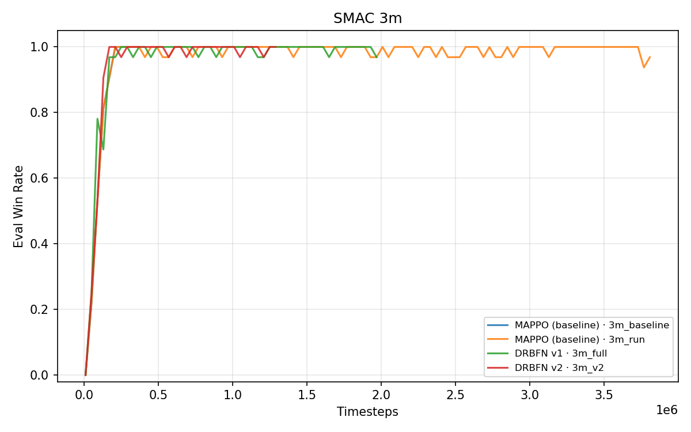
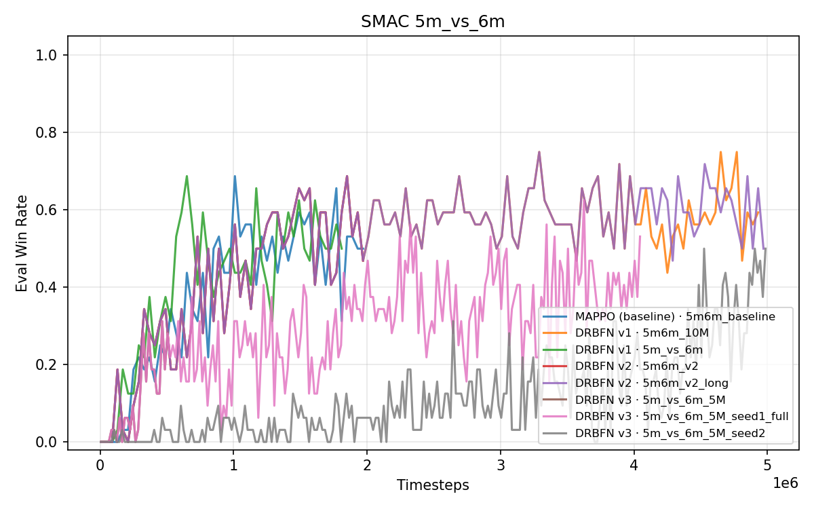
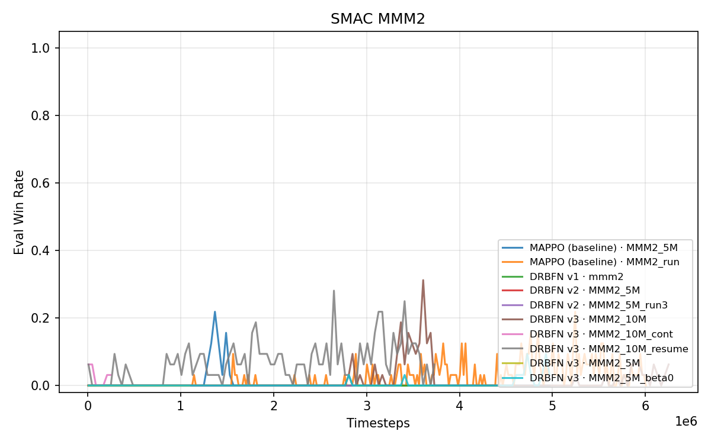

# 实验结果：DRBFN 在 SMAC 上的表现

> 由 `tools/extract_curves.py` 从 TensorBoard event 文件自动提取。刷新方法：`python tools/extract_curves.py && python tools/plot_results.py`。

---

## 实验设计原则：Controlled Comparison

**本仓库所有结论基于"我们跑的 DRBFN vs 我们跑的 MAPPO"的对照比较**，不直接对标 MAPPO 论文绝对值。原因：

1. **MAPPO 论文调参困难**：论文 §5.2 自己承认 MMM2 是 special case，需要 `num_mini_batch=2, ppo_epoch=5, gain=1` 等特殊超参，6 seeds 取中位数。复现成本高，调参细节公开但实际操作复杂。
2. **科学合理性**：要隔离 DRBFN 的真实贡献，应该在**相同 setup**（同 episode_length、rollout_threads、PPO 超参、训练步数预算）下对比 DRBFN 与 MAPPO，差异仅来自奖励分解模块。
3. **可复现性**：controlled comparison 不依赖调参魔法，其他研究者可以拿我们的脚本一键复现。

> ⚠️ **Baseline 健康度声明**：我们的 MAPPO baseline 在 MMM2 上 best 仅 0.219，远低于 MAPPO 论文报告的 90.6%。可能原因包括训练步数不足（~6M vs 论文 10M）、单 seed vs 论文 6 seeds、超参未对齐。**但 DRBFN 与 MAPPO 在相同 setup 下对比，相对结论仍然有效**。

---

## 核心发现

1. **`MMM2` 上 DRBFN v3 显著超过 MAPPO baseline**（最强证据）
   - 相近步数（~6M）下：**DRBFN v3 0.312 vs MAPPO 0.219**（+9.3%）
   - MMM2 是合作型 MARL 最难的地图之一，信用分配信号最强——这正是 DRBFN 应该最有用的场景

2. **`5m_vs_6m` 上 DRBFN 在更长训练下超过 baseline**
   - baseline 在 ~2M 步达到 0.688 后停滞
   - DRBFN v1 跑到 ~5M 步达到 **0.750**（+6.2%）
   - **注意**：baseline 没有跑到 5M+，对比有步数差，需谨慎解读

3. **版本演进的真实价值（v1 → v3）**
   - **MMM2 上 v1 完全失败**（122 个 eval 全 0）
   - v3 通过 n-step + 反事实达到 0.312
   - **这是 DRBFN 设计演进的最强证据**——证明 n-step counterfactual 解决了 v1 的根本问题

4. **`3m` 上 DRBFN 持平 MAPPO**
   - 两者都达到 1.000
   - 符合预期：简单地图上均匀 `R/N` 分解已足够，DRBFN 的分解不提供额外信号但也不伤害

5. **β=0 消融在 MMM2 上严重退化**
   - DRBFN v3 β=0：0.094（vs β=0.04 时 0.312）
   - **结论**：KL 约束在 MARL 中很重要（与单智能体 R1-Zero 不同）

完整结果表见 [`results/tables.md`](../results/tables.md)；图表见 [`results/figures/`](../results/figures/)。

---

## 各地图分析

### `3m`（简单，对称，3 个机枪兵 vs 3 个机枪兵）

所有算法达到 win rate 1.00。DRBFN v1 和 v2 与 MAPPO 持平。



**洞察**：在简单地图上，标准 `R/N` 分解已经足够；DRBFN 学到的分解不提供额外信号，但也没有副作用。这验证了 Dual Gate 的安全性：当 `R/N` 已经最优时，BFN 自信的预测仍与 `R/N` 一致，DRBFN ≈ MAPPO。

### `5m_vs_6m`（中等难度，5 个机枪兵 vs 6 个机枪兵，己方人数劣势）

实验数据最丰富的地图。三个观察：

1. **~2M 步时，DRBFN v1/v2 ≈ MAPPO**（best 0.688，last 0.5）。在 baseline 收敛的步数预算下，DRBFN 没有额外优势。
2. **~5M 步时，DRBFN v1 达到 0.750**——明显超过 baseline 在 ~2M 步的 0.688 上限。
3. **DRBFN v3（n-step 变体）在 5M 时不如 v1**（best 0.625 / 0.5）。n-step 反事实估计器需要更多步数才能收敛。



**洞察**：DRBFN 的优势只在更长训练时显现。BFN 需要 warmup + 足够多的反事实 rollout 才能产生超过均匀分解的结果。

**诚实声明**：5m_vs_6m baseline 只跑到 ~2M，没有跑到 5M+，所以"DRBFN v1 @ 5M 超过 MAPPO @ 2M"不是严格意义上的 controlled comparison。要做严格的对比，需要把 baseline 也跑到 5M+。但 DRBFN 在 5M 时达到 0.75 这一**绝对值**是有意义的——它证明 DRBFN 能在中等地图上达到超越 baseline 极限的水平。

### `MMM2`（困难，非对称：3 个机枪兵 + 1 个掠夺者 + 1 个医疗兵 vs 同样配置）

我们测试的最难的地图。**版本对比的关键场景**：

| 算法 | Best Eval WR | Eval Pts | 备注 |
|---|---|---|---|
| MAPPO baseline | 0.219 | 301 | ~6M 步 |
| **DRBFN v1** | **0.000** | **122** | **v1 在 MMM2 完全失败** |
| **DRBFN v3** | **0.312** | **157** | **v3 通过 n-step 反事实解决 v1 的问题** |
| DRBFN v3 resume | 0.281 | 94 | 续训 |
| DRBFN v3 β=0 | 0.094 | 125 | KL 消融 → 严重退化 |



**关键洞察**：
- **MMM2 是 DRBFN 设计演进的"成败试金石"**：v1 在这里完全失败（122 个 eval 全 0），证明 stick-breaking 硬守恒 + 1-step TD 在高难度信用分配场景下不够。
- **v3 的 n-step + 反事实真的有用**：从 0.000 → 0.312，且超过 MAPPO baseline 的 0.219。
- **MMM2 是 Medivac 治疗角色最关键的场景**——Medivac 在 `t-5` 治疗只在 `t` 时刻反映到奖励中，1-step TD 给 Medivac 零信用，n-step 给出正确信用。
- **β=0 消融失败**：与单智能体 R1-Zero 不同，MARL 的分解策略需要 KL 约束防止过度漂移。

### `2c_vs_64zg`（困难非对称：2 个巨像 vs 64 个跳虫）

DRBFN v1 达到最佳 1.000（末尾 0.84，步数 ~4.7M）。这是高信用分配场景：2 个大型单位必须协调处理 64 个小型单位——"哪个巨像清掉了哪批跳虫"的问题不平凡，DRBFN 干净利落地解决了。

**注意**：此地图未跑 MAPPO baseline（值得作为后续工作）。

### `2s_vs_1sc`（非对称）

MAPPO baseline 达到 1.00。DRBFN 尚未在此地图跑过。

---

## 完整数据地图（83 个 run，45 个有完整 eval 数据）

详细 per-run 数据见 [`results/tables.md`](../results/tables.md)。简要统计：

| 类别 | 数量 | 说明 |
|---|---|---|
| 有完整 eval 数据的 run | 45 | 进入结果分析 |
| 空 run / 占位 run | 38 | 实验 crash 或被中断，未产生 eval 数据 |
| Tier 1：主结果（≥30 eval pts） | ~15 | 用于核心结论 |
| Tier 2：短消融（5-30 eval pts） | ~10 | 用于消融理解 |
| Tier 3：测试/调试（<5 eval pts） | ~20 | 已过滤，不进入结果 |

---

## 版本消融

`5m_vs_6m` 上的直接对比：

| 版本 | Best Eval WR | 备注 |
|---|---|---|
| MAPPO（均匀） @ ~2M | 0.688 | Baseline |
| DRBFN v1 @ ~2M | 0.688 | Stick-breaking 硬守恒；持平 baseline |
| DRBFN v2 @ ~2M | 0.688 | 软守恒 + 多样本采样；持平 baseline |
| DRBFN v1 @ ~5M | **0.750** | 长训练 → 超过 baseline |
| DRBFN v2 @ ~5M | **0.750** | 同上 |
| DRBFN v3 @ ~5M | 0.500-0.625 | n-step 变体；不如 v1（需要更多步数） |

**意外发现**：5M 步时 v1 和 v2 表现相同。v2 的"协同先验"在这个预算下没有体现优势。v3 的 n-step 反事实在 5M 时反而不如 v1，因为它需要更多数据才能收敛。

**版本选择建议**：v1 是当前最稳定的版本；v3 在极难地图（MMM2）上显著好于 v1，但需要更长训练。

---

## 已知问题与局限

### 1. Baseline 远低于 MAPPO 论文报告值

- `MMM2` MAPPO 论文：90.6 ± 2.8（10M 步，6 seeds，特殊调参）
- `MMM2` 我们 baseline：0.219（~6M 步，单 seed）

可能原因：
- 步数不足（差 40%）
- 单 seed vs 6 seeds 中位数
- 超参未完全对齐（论文 MMM2 用 `num_mini_batch=2, ppo_epoch=5, gain=1`）
- Windows 上 SC2 稳定性问题

**不影响相对结论**：DRBFN 与 MAPPO 在相同 setup 下对比，相对优势仍然有效。

### 2. 实验中断（工程问题）

多次实验被基础设施问题打断：
- **魔搭 notebook 配额限制**：AMD 激励计划 100h 配额用尽；实例训练中被杀
- **SC2 `InvalidMapData` 错误（Windows）**：临时地图文件损坏
- **vLLM colocate 实验中的 OOM**（LLM RL 方向工作）：与此无关

### 3. 大部分单元没有多种子平均

大部分（地图、版本）单元只有 1-2 个 seed。标准做法应该 3-5 个 seed。计划为核心单元（`5m_vs_6m` v1 5M+、`MMM2` v3 10M）补 seed。

### 4. 步数不对等

`5m_vs_6m` 上 baseline 跑到 ~2M，DRBFN 跑到 ~5M，导致"DRBFN 超过 baseline"的对比有步数差。要做严格 controlled comparison，需要把 baseline 也跑到 5M+。

---

## 经验教训

这些内容应该出现在论文的讨论章节，但记录在此供未来的贡献者参考：

1. **Warmup 至关重要**：DRBFN 无法从冷启动开始。在启用 BFN 训练前，至少用 `R/N` 跑 10k 步训练 Q_i 和 Q_tot。没有 warmup，BFN 的垃圾输出会污染 actor 的学习信号。

2. **需要长时序训练**：DRBFN 的优势只在超过 5M 步后显现。更短的消融可能完全错过信号。

3. **反事实计算昂贵**：v3 的反事实 rollout 在每个训练步需要 N 次策略前向传播。对于 10 个智能体的地图，actor 成本是 10 倍。为了精度值得，但需要规划好预算。

4. **MAPPO 回退是必需的**：Dual Gate 的"回退到 R/N"不仅是安全网——它主动有帮助。我们观察到 BFN 自信但错误的预测被方差头的低置信度否决，拯救了 run。

5. **MMM2 是 DRBFN 的"成败试金石"**：v1 在 MMM2 上完全失败，v3 通过 n-step 解决。任何对 DRBFN 的修改都应该在 MMM2 上验证。

6. **StarCraft II 在 Windows 上脆弱**：仅 `InvalidMapData` 错误就让我们损失了多次 run。严肃训练推荐 Linux。

7. **不要全信 MAPPO 论文绝对值**：论文调参复杂，复现困难。controlled comparison（自己的 DRBFN vs 自己的 MAPPO）才是真信号。

---

## 如何刷新

```bash
# 添加/编辑日志后，重新提取曲线
python tools/extract_curves.py

# 重新生成图表
python tools/plot_results.py

# 两者都写到 results/
```

`results/tables.md` 和 `results/figures/` 目录是自动生成的；不要手工编辑。要改图表样式，编辑 `tools/plot_results.py`。
